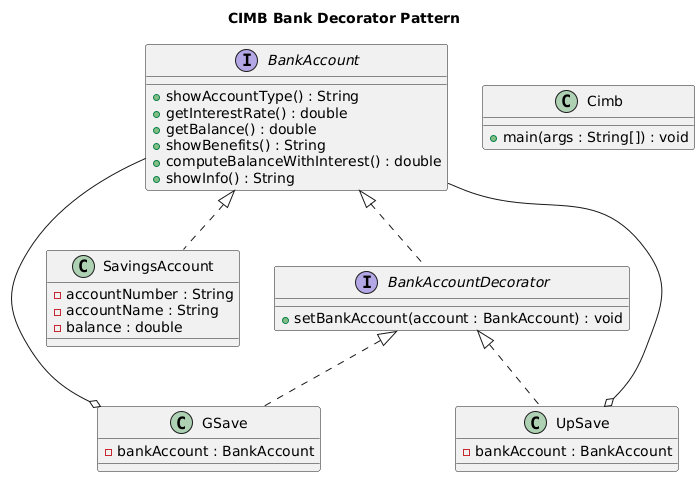

# Lab Assignment 7: CIMB with Decorator Pattern

## UML Diagram



## Overview

**CIMB** is a digital bank that offers GSave and UpSave savings accounts. As with a typical Savings Account, it contains:
- `accountNumber`
- `accountName`
- `balance`

## Account Types and Features

### Savings Account (Standard)
- **Interest Rate:** 1%
- **Benefits:** Standard Savings Account

### GSave Account
- **Interest Rate:** 2.5%
- **Benefits:** 
  - Standard Savings Account
  - GCash transfer

### UpSave Account
- **Interest Rate:** 4.0%
- **Benefits:** 
  - Standard Savings Account
  - With Insurance

## Instructions

Develop a decorator pattern approach that will implement the given UML diagram.

### Cimb.java Implementation

The content of your `Cimb.java` should ONLY contain the following code (with the exception of inserting your own package name):

```java
public class Cimb {

	public static void main(String[] args) {
		
		SavingsAccount account = new SavingsAccount();
		
		account.setAccountNumber(1234);
		account.setAccountName("Juan Dela Cruz");
		account.setBalance(10000.0);
		
		System.out.println(account.showInfo());
		System.out.println("Account type: " + account.showAccountType());
		System.out.println("Interest rate: " + account.getInterestRate());
		System.out.println("New balance: " + account.computeBalanceWithInterest());
		System.out.println("Benefits: " + account.showBenefits());
		
		System.out.println("----------------------");
		
		GSave gSave = new GSave(account);
		System.out.println(gSave.showInfo());
		System.out.println("Account type: " + gSave.showAccountType());
		System.out.println("Interest rate: " + gSave.getInterestRate());
		System.out.println("New balance: " + gSave.computeBalanceWithInterest());
		System.out.println("Benefits: " + gSave.showBenefits());
		
		System.out.println("----------------------");
		
		UpSave upSave = new UpSave(account);
		System.out.println(upSave.showInfo());
		System.out.println("Account type: " + upSave.showAccountType());
		System.out.println("Interest rate: " + upSave.getInterestRate());
		System.out.println("New balance: " + upSave.computeBalanceWithInterest());
		System.out.println("Benefits: " + upSave.showBenefits());
	}
}
```

## Expected Output

You should display the following output:

*(Expected output details to be shown when running the program)*

## Method Descriptions

| Method | Description |
|--------|-------------|
| `showAccountType()` | Returns either "Savings Account", "GSave", or "UpSave" |
| `getInterestRate()` | Returns 1% for Savings Account; 2.5% for GSave; 4.0% for UpSave |
| `getBalance()` | Returns the balance of the account set |
| `showBenefits()` | Returns "Standard Savings Account" for Savings Account; benefits offered by savings account + "GSave Transfer" for GSave; benefits offered by savings account + "With Insurance" for UpSave |
| `computeBalanceWithInterest()` | Returns new balance by computing the balance plus the interest depending on the interest rate |
| `showInfo()` | Returns details of account number, account name, and balance |

## Important Notes

- **`BankAccountDecorator` must be an interface.**
- Follow instructions carefully.
- You are **not allowed** to insert other methods except what is stated in the diagram (setters and getters are allowed).


